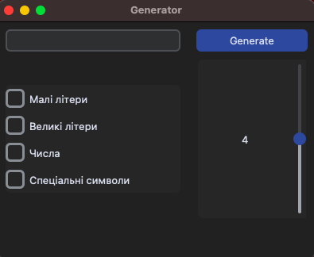

🔐 Password Generator in Python

This is a simple and user-friendly GUI application written in Python using the customtkinter library.  
It allows you to generate strong passwords with custom settings:

- include lowercase and uppercase letters  
- digits and special characters  
- adjustable password length (from 4 to 64)  

🖼 Screenshot:  


🚀 How to run:

```bash
pip install customtkinter
python generator.py
